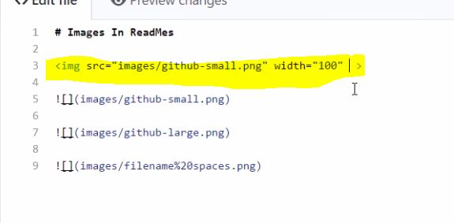

# Data Science Portfolio by Josh Janjua

This portfolio is a compilation of notebooks which I created for data analysis or for exploration of machine learning algorithms. A separate category is for separate projects.

## Data Cleaning/Structuring

### Kitesurfing Email 
  My interest in [Kiteboarding](https://www.youtube.com/watch?v=yl8hiSHuhiI) has increased with *almost* the same velocity as my interest in data science. In Kiteboarding, you need to have a good weather forecast and I always found myself checking the wind. Took the opportunity to create code that pulls the relevant information from an [API](https://darksky.net/forecast/12.1217,-68.861/us12/en_) for my location and uploaded it to AWS so that I get an email every week for the forecast for the upcoming weekend.
  

### DMA
--use this code to add images later on.

### Kaggle Pipeline
  Enrolled in a [Kaggle Learning](https://www.kaggle.com/professional-skills-series#pipelines) on automating data pipelines. 

## Data Analysis

### C2S

## Machine Learning

### Regression - Housing Prices
### Classification - Titanic

## Dashboarding

### Kaggle LA Dashboard

# including Andrey's details to use formatting
# Data science portfolio by Andrey Lukyanenko

This portfolio is a compilation of notebooks which I created for data analysis or for exploration of machine learning algorithms. A separate category is for separate projects.

## Stand-alone projects.

### Handwritten digit recognition

This is my own project using image recognition methods in practice. This is a site (also works on mobile) where user can draw a digit, and machine learning models (FNN and CNN) will try to recognize it. After than models can use the drawn digit for training to improve their accuracy. Live version is [here](https://digits-draw-recognize.herokuapp.com/). The code can be found [here](https://github.com/Erlemar/digit-draw-recognize).

### Chatbot in telegram

A conversational chatbot in [telegram](http://t.me/amlnlpbot) which was created for an honor assignment of [nlp course by Higher School of Economics](https://www.coursera.org/learn/language-processing/home/welcome). The main functionality of the bot is to distinguish two types of questions (questions related to programming and others) and then either give an answer or talk using a conversational model.

## Kaggle competitions.

### Avito demand prediction

[Avito demand prediction](https://www.kaggle.com/c/avito-demand-prediction) was a competition on Kaggle where we tried to predict something like demand based on ads content. This competition was very interesting because it had tabular data, texts and images. On the other hand this was the reason the competition was quite difficult. My team reached 131th place and got bronze medal! Here is a [link](https://github.com/Erlemar/Avito_demand_prediction_2018) to my solution.

### Categorization of purchases

[This](https://www.kaggle.com/c/receipt-categorisation) was a Russian inclass Kaggle competition in the third session of ODS ml course. It sounded interesting and I took part in it reaching a 3rd place. [Here](https://www.kaggle.com/artgor/3rd-place-solution) is my kaggle kernel with a solution.
