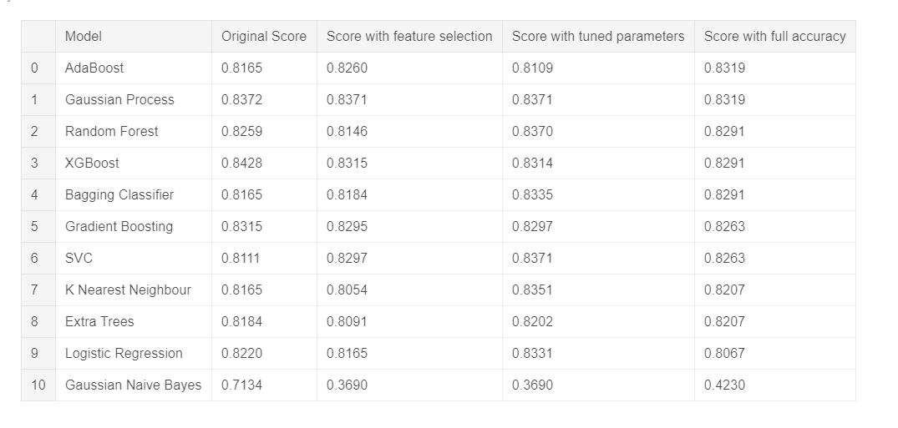

# Data Science Portfolio by Josh Janjua

This portfolio is a compilation of projects which I created for data clarning/structuring, data analysis, machine learning, or dashboarding.

## Data Cleaning/Structuring

### Kiteboarding Email 
  My interest in [Kiteboarding](https://www.youtube.com/watch?v=yl8hiSHuhiI) has increased with *almost* the same velocity as my interest in data science. In Kiteboarding, you need to have a good weather forecast and I always found myself checking the wind. Took the opportunity to create code that pulls the relevant information from an [API](https://darksky.net/forecast/12.1217,-68.861/us12/en_) for my location and uploaded it to AWS so that I get an email every week for the forecast for the upcoming weekend. 
  
This exercise reinforced interacting with API's, working with JSON data, scheduling activities, and productionalizjng code by uploading to the cloud.
  

### DMA Analysis
  The goal of this project was to analyze and optimize a client's customer routing capabilities. Specifically, taking into account key factors by DMA to assess if there were any DMA's that were converting at a secondary or tertiary location better than primary. I used a variety of factors to filter my results including average monthly flight count and average flight time. I used [Selenium](https://en.wikipedia.org/wiki/Selenium_(software)) to automatically download a file from the [US Bureau of Transportation Statistics](https://www.transtats.bts.gov/Tables.asp?DB_ID=111&DB_Name=Air%20Carrier%20Statistics%20%28Form%2041%20Traffic%29-%20All%20Carriers&DB_Short_Name=Air%20Carriers) and incororate it into my analysis. The analysis reports back the opportunity DMA's based upon the customer requirements.
  
This project reinforced joining together large datasets from disparate sources (577k rows in final dataset), automating external data incorporation, and structuring in a meaningful way for easily reporoducible analysis.

### Kaggle Pipeline
  I enrolled in a [Kaggle Learning](https://www.kaggle.com/professional-skills-series#pipelines) on automating data pipelines. I chose the live [gun violence data set](https://github.com/jamesqo/gun-violence-data) and set it to update weekly while I ran a validation check on data types, presence of key inputs, and missing data. I then used ETL to pair down the national data to specifically the number of FL residents injured or killed by month and year.

The learning reinforced versioning with a dataset from a URL endpoint, creating data validation checks, and performng ETL. 

[Notebook](https://www.kaggle.com/joshjanjua/data-pipeline-fl-mass-shootings)

## Data Analysis

### Cost Analysis
  The goal of this project was to analyze and identify client's spend opportunities. We combined corporate productivity metrics with time studies gathered at the sites to validate the initial data set. The initial data set was 500k+ rows and included 24 departments across 5 locations. A follow up, deeper analysis data set was an additional 500k+ rows and focused on descrepancies in 7 departments. Information was exported from Qlikview as a txt file and uploaded for analysis. I identified the root causes for location differences. 
  
This project reinforced working with data as a text file, structure it for automated recurring analysis, and craft a targeted story for client executives.

## Machine Learning

### Regression - Housing Prices
  I was interested in learning best practices for linear regression and wanted to put some of my skills to use. I joined the [Kaggle Housing Prices competition](https://www.kaggle.com/c/house-prices-advanced-regression-techniques) and my main focus to was simply learn about and use common linear regression algorithms. Specifically, I focused on Linear Regression (as a baseline), Ridge Regression, Lasso Regression, and Elasic Net. I was able to explain 91.2% of the variance with a RMSE (competition scoring metric) of 0.12117, which put me around the top 28%.
  
This competition reinforced data transformation, automated feature selection, and regularization. 

[Notebook](https://www.kaggle.com/joshjanjua/housing-prices-comp)
  

### Classification - Titanic
  Similarly, I was interested in learning best practices with logistic regression. I joined the [Kaggle Titanic Competition](https://www.kaggle.com/c/titanic) with my focus on optimizing prediction using a variety of algoritms. I cycled through various classification algorithms to test performance against the data set including Logistic Regression, K Nearest Neighbors, Random Forest, Gaussian Naive Bayes, Decision Trees, Support Vector Machines, and Gradient Boosting with XGBoost. I then tuned hyper parameters to maximize performance. Ultimately, I achieved an accuracy of 81% which landed me in the top 6% of participants. 
  
This competition reinforced automated machine learning algorithm comparison, feature selection, and hyper parameter tuning. 

[Notebook](https://www.kaggle.com/joshjanjua/titanic-comp)

## Dashboarding

### Economic Indicators Dashboard
   The goal of this project was to create a dashboard that focused on tracking and displaying the economic impacts due to the COVID-19 pandemic globally. I owned project management, analytics, and automation for this interactive daily dashboard. The dashboard is hosted using [ESRI](https://www.esri.com/en-us/home). I identified 50 different publicly available sources covering indicators including leading stock price indices, consumer price index, consumer confidence index, daily commodity prices, yield curves, and interest rates. I fully automated the data pipeline using [AWS](https://aws.amazon.com/). Specifically, a multi-layered lambda function with a cloudwatch event timer to save to an S3 bucket and upload through ESRI's Python [API](https://developers.arcgis.com/python/api-reference/) daily. This automation saves 2.5 hours of manual effort daily. The dashboard was pinned on the top of my organization's COVID-19 webpage and recieved praise from the Chief Marketing Officer.
   
   This project reinforced data pipeline creation, automation using serverless computing, cloud storage, and updating through an API.
   

### Kaggle LA Dashboard
  I enrolled in a [Kaggle Learning](https://www.kaggle.com/rtatman/dashboarding-with-notebooks-day-1?utm_medium=email&utm_source=intercom&utm_campaign=dashboarding-event) on dashboarding with Notebooks. I chose the live L.A. parking ticket [dataset](https://www.kaggle.com/cityofLA/los-angeles-parking-citations) to visualize. I created data validation, visualized the last week's parking citations using [Folium](https://pypi.org/project/folium/), and trended the count by day, by hour, and by reason using [Plotly](https://plot.ly/python/). I then uploaded a refresh code to Google Cloud so that it would on the kaggle server nightly.
  
This learning reinforced the concepts of geospatial translation, data visualization, and productionalization using the cloud.
  
[Notebook](https://www.kaggle.com/joshjanjua/kaggle-dashboarding-la/notebook)
 

