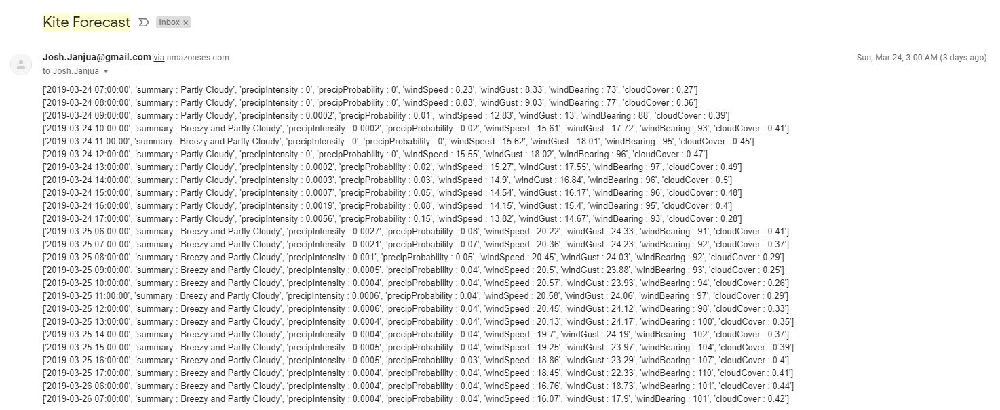
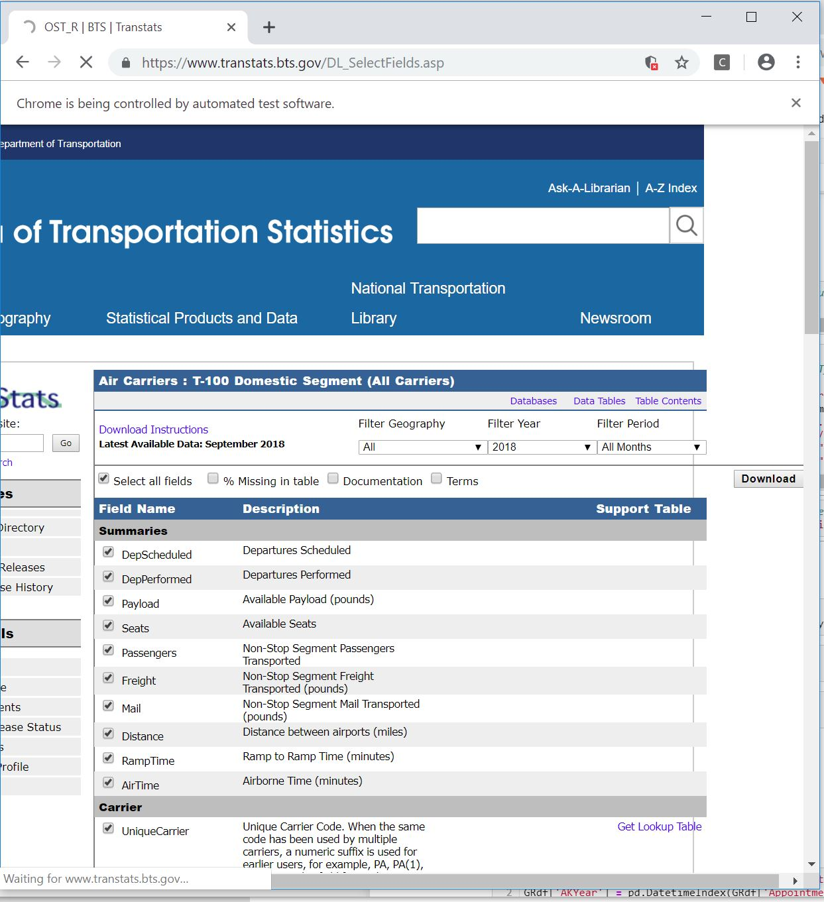
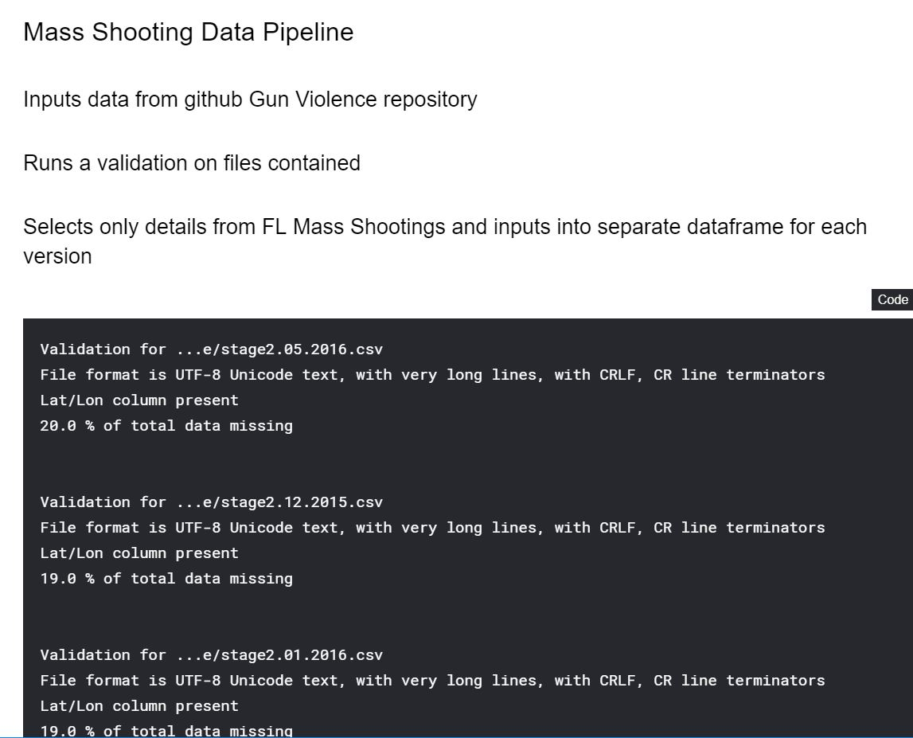
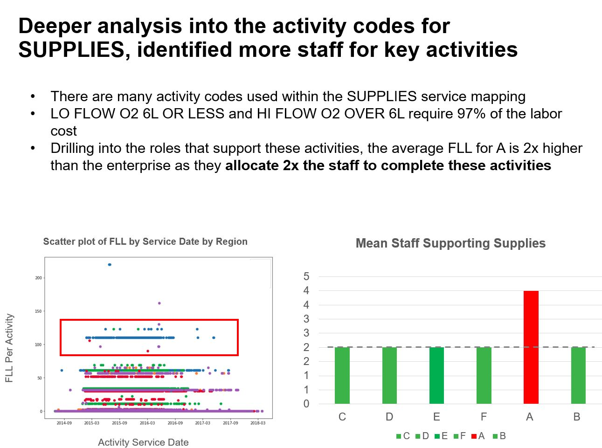
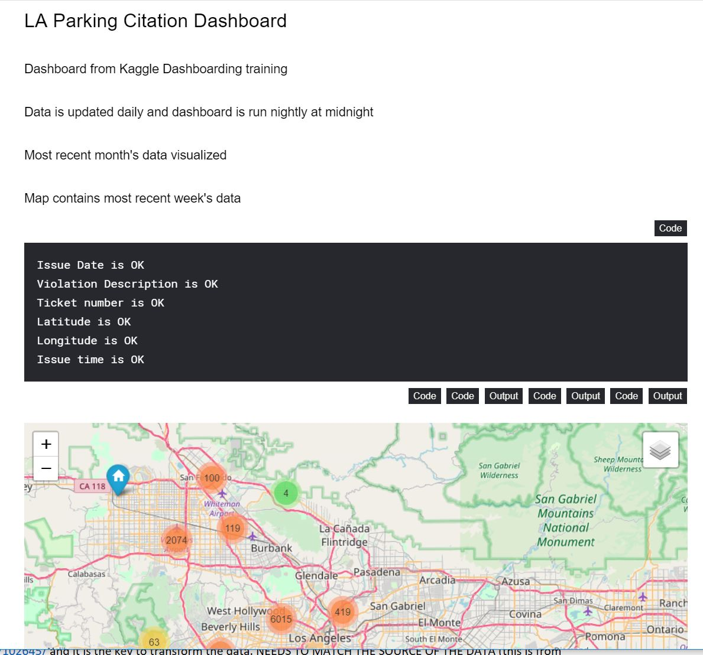

# Data Science Portfolio by Josh Janjua

This portfolio is a compilation of projects which I created for data structuring, data analysis, or machine learning. 

## Data Cleaning/Structuring

### Kiteboarding Email 
  My interest in [Kiteboarding](https://www.youtube.com/watch?v=yl8hiSHuhiI) has increased with *almost* the same velocity as my interest in data science. In Kiteboarding, you need to have a good weather forecast and I always found myself checking the wind. Took the opportunity to create code that pulls the relevant information from an [API](https://darksky.net/forecast/12.1217,-68.861/us12/en_) for my location and uploaded it to AWS so that I get an email every week for the forecast for the upcoming weekend. 
  
This exercise reinforced interacting with API's, working with JSON data, scheduling activities, and productionalizjng code by uploading to the cloud.
  
 Notebook
 

### DMA Analysis
  The goal of this project was to analyze and optimize a client's customer routing capabilities. Specifically, taking into account key factors by DMA to assess if there were any DMA's that were converting at a secondary or tertiary location better than primary. I used a variety of factors to filter my results including average monthly flight count and average flight time. I used [Selenium](https://en.wikipedia.org/wiki/Selenium_(software)) to automatically download a file from the [US Bureau of Transportation Statistics](https://www.transtats.bts.gov/Tables.asp?DB_ID=111&DB_Name=Air%20Carrier%20Statistics%20%28Form%2041%20Traffic%29-%20All%20Carriers&DB_Short_Name=Air%20Carriers) and incororate it into my analysis. The analysis reports back the opportunity DMA's based upon the customer requirements.
  
This project reinforced joining together large datasets from disparate sources (577k rows in final dataset), automating external data incorporation, and structuring in a meaningful way for easily reporoducible analysis.

Notebook

### Kaggle Pipeline
  I enrolled in a [Kaggle Learning](https://www.kaggle.com/professional-skills-series#pipelines) on automating data pipelines. I chose the live [gun violence data set](https://github.com/jamesqo/gun-violence-data) and set it to update weekly while I ran a validation check on data types, presence of key inputs, and missing data. I then used ETL to pair down the national data to specifically the number of FL residents injured or killed by month and year.

The learning reinforced versioning with a dataset from a URL endpoint, creating data validation checks, and performng ETL. 

[Notebook]((https://www.kaggle.com/joshjanjua/data-pipeline-fl-mass-shootings))

## Data Analysis

### Cost Analysis
  The goal of this project was to analyze and identify client's spend opportunities. We combined corporate productivity metrics with time studies gathered at the sites to validate the initial data set. The initial data set was 500k+ rows and included 24 departments across 5 locations. A follow up, deeper analysis data set was an additional 500k+ rows and focused on descrepancies in 7 departments. Information was exported from Qlikview as a txt file and uploaded for analysis. I identified the root causes for location differences. 
  
This project reinforced working with data as a text file, structure it for automated recurring analysis, and craft a targeted story for client executives.

Notebook

## Machine Learning

### Regression - Housing Prices
  I was interested in learning best practices for linear regression and wanted to put some of my skills to use. I joined the [Kaggle Housing Prices competition](https://www.kaggle.com/c/house-prices-advanced-regression-techniques) and my main focus to was simply learn about and use common linear regression algorithms. Specifically, I focused on Linear Regression (as a baseline), Ridge Regression, Lasso Regression, and Elasic Net. Ridge, Lasso, and Elastic Net all use regularization techniques. I was able to reach an accuracy of XXX, with a RMSE (competition scoring metric) of .12117, which put me around the top 28%.
  
  STOPPED HERE!
  
### Classification - Titanic

## Dashboarding

### Kaggle LA Dashboard
  I enrolled in a [Kaggle Learning](https://www.kaggle.com/rtatman/dashboarding-with-notebooks-day-1?utm_medium=email&utm_source=intercom&utm_campaign=dashboarding-event) on dashboarding with Notebooks. I chose the live L.A. parking ticket [dataset](https://www.kaggle.com/cityofLA/los-angeles-parking-citations) to visualize. I created data validation, visualized the last week's parking citations using [Folium](https://pypi.org/project/folium/), and trended the count by day, by hour, and by reason using [Plotly](https://plot.ly/python/). I then uploaded a refresh code to Google Cloud so that it would on the kaggle server nightly.
  
  This learning reinforced the concepts of geospatial translation, data visualization, and productionalization using the cloud.
  
[Notebook](https://www.kaggle.com/joshjanjua/kaggle-dashboarding-la/notebook)
 

# including Andrey's details to use formatting
# Data science portfolio by Andrey Lukyanenko

This portfolio is a compilation of notebooks which I created for data analysis or for exploration of machine learning algorithms. A separate category is for separate projects.

## Stand-alone projects.

### Handwritten digit recognition

This is my own project using image recognition methods in practice. This is a site (also works on mobile) where user can draw a digit, and machine learning models (FNN and CNN) will try to recognize it. After than models can use the drawn digit for training to improve their accuracy. Live version is [here](https://digits-draw-recognize.herokuapp.com/). The code can be found [here](https://github.com/Erlemar/digit-draw-recognize).

### Chatbot in telegram

A conversational chatbot in [telegram](http://t.me/amlnlpbot) which was created for an honor assignment of [nlp course by Higher School of Economics](https://www.coursera.org/learn/language-processing/home/welcome). The main functionality of the bot is to distinguish two types of questions (questions related to programming and others) and then either give an answer or talk using a conversational model.

## Kaggle competitions.

### Avito demand prediction

[Avito demand prediction](https://www.kaggle.com/c/avito-demand-prediction) was a competition on Kaggle where we tried to predict something like demand based on ads content. This competition was very interesting because it had tabular data, texts and images. On the other hand this was the reason the competition was quite difficult. My team reached 131th place and got bronze medal! Here is a [link](https://github.com/Erlemar/Avito_demand_prediction_2018) to my solution.

### Categorization of purchases

[This](https://www.kaggle.com/c/receipt-categorisation) was a Russian inclass Kaggle competition in the third session of ODS ml course. It sounded interesting and I took part in it reaching a 3rd place. [Here](https://www.kaggle.com/artgor/3rd-place-solution) is my kaggle kernel with a solution.
