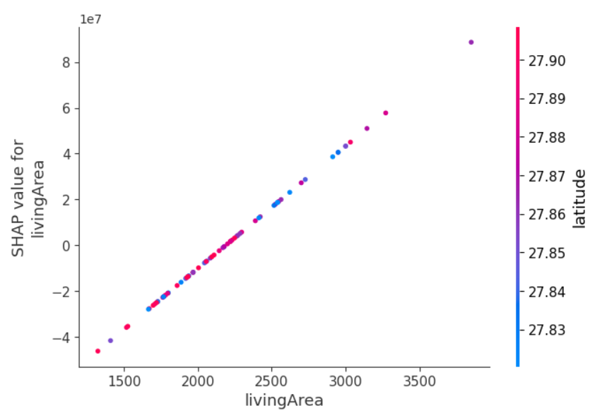
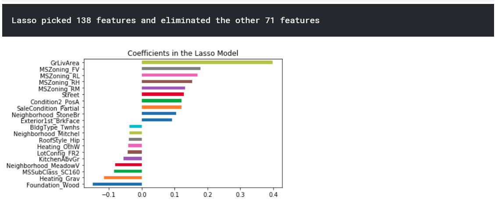

# Data Science Portfolio by Josh Janjua

This portfolio is a compilation of projects that I created for data cleaning/structuring, data analysis, machine learning, or dashboarding.

## Interactive Applications

### Housing Prediction Streamlit App

  I developed a real estate price prediction and analysis app for homes that are of interest to me in my immediate area, leveraging various data science techniques to enhance  functionality and insights. The core of the app centers around the ElasticNet machine learning model, which I selected by using an algorithm harness including various models like Linear Regression, ElasticNet, and XGBoost Regressor, with a variety of scalers including Standard, MinMax, and Robust to identify the best-performing pipeline. A significant feature of this project was the use of SHAP (SHapley Additive exPlanations) to not only remove outliers but also to understand feature importances, providing a deeper insight into the factors driving housing prices. There were a few instances where I identified data that needed to be cleaned. One real estate nuance I learned, was if a house has a pond in the back, then the square footage of the pond is included in the lot size! There was one house that had a pond with some woods which had a gigantic lot size and was skewing my predictions so I imputed the mean lot size of houses that had sold in a similar range to get a sense of useable backyard space.

 Skills Highlighted:

- Advanced Preprocessing: Employed sophisticated data preprocessing methods.
- Feature Engineering: Crafted features that precisely reflect the nuances of real estate valuation.
- Model Pipeline Development: Constructed and fine-tuned a robust model pipeline.
- Streamlit Deployment: Successfully deployed the app with Streamlit, enhancing user interaction.
- Predictive Insights: Enabled accurate price predictions and dynamic data filtering for user-specified parameters like bedrooms and bathrooms.
- Practical Application: Solidified the app's practicality for real-world real estate analytics.

## Data Cleaning/Structuring

### Kiteboarding Email 
  My interest in [Kiteboarding](https://www.youtube.com/watch?v=yl8hiSHuhiI) has increased with *almost* the same velocity as my interest in data science. In Kiteboarding, you need to have a good weather forecast and I always found myself checking the wind. Took the opportunity to create code that pulls the relevant information from an [API](https://darksky.net/forecast/12.1217,-68.861/us12/en_) for my location and uploaded it to AWS so that I get an email every week for the forecast for the upcoming weekend. 
  
  Skills Highlighted:

- API Interaction: Utilized Dark Sky API to fetch real-time weather data.
- Data Handling: Efficiently managed JSON data formats.
- Task Automation: Automated weekly weather data retrieval and email notifications.
- Cloud Integration: Deployed the application on AWS for consistent and remote access.

### DMA Analysis
  The goal of this project was to analyze and optimize a client's customer routing capabilities. Specifically, taking into account key factors by DMA to assess if there were any DMA's that were converting at a secondary or tertiary location better than primary. I used a variety of factors to filter my results including average monthly flight count and average flight time. I used [Selenium](https://en.wikipedia.org/wiki/Selenium_(software)) to automatically download a file from the [US Bureau of Transportation Statistics](https://www.transtats.bts.gov/Tables.asp?DB_ID=111&DB_Name=Air%20Carrier%20Statistics%20%28Form%2041%20Traffic%29-%20All%20Carriers&DB_Short_Name=Air%20Carriers) and incorporate it into my analysis. The analysis reports back the opportunity DMA's based upon the customer requirements.
  
  Skills Highlighted:

- Data Integration: Joined large datasets (577k+ rows) from various sources.
- Web Scraping: Automated data extraction using Selenium from the US Bureau of Transportation Statistics.
- Analytical Reporting: Delivered actionable insights for client decision-making.

### Kaggle Pipeline
  I enrolled in a [Kaggle Learning](https://www.kaggle.com/professional-skills-series#pipelines) on automating data pipelines. I chose the live [gun violence data set](https://github.com/jamesqo/gun-violence-data) and set it to update weekly while I ran a validation check on data types, presence of key inputs, and missing data. I then used ETL to pair down the national data to specifically the number of FL residents injured or killed by month and year.

  Skills Highlighted:

- Data Versioning: Managed dataset updates from a URL endpoint.
- Data Validation: Implemented checks for data types and completeness.
- ETL Processes: Extracted, transformed, and loaded data for focused analysis.

[Notebook](https://www.kaggle.com/joshjanjua/data-pipeline-fl-mass-shootings)

## Data Analysis

### Cost Analysis
  The goal of this project was to analyze and identify client's spend opportunities. We combined corporate productivity metrics with time studies gathered at the sites to validate the initial data set. The initial data set was 500k+ rows and included 24 departments across 5 locations. A follow-up, deeper analysis data set was an additional 500k+ rows and focused on discrepancies in 7 departments. Information was exported from Qlikview as a txt file and uploaded for analysis. I identified the root causes for location differences. 

  Skills Highlighted:
  
- Data Management: Processed large text datasets (500k+ rows).
- Automated Analysis: Developed a system for ongoing, automated analysis.
- Executive Reporting: Tailored insights for client executives' strategic decision-making

## Machine Learning

### Regression - Housing Prices
  I was interested in learning best practices for linear regression and wanted to put some of my skills to use. I joined the [Kaggle Housing Prices competition](https://www.kaggle.com/c/house-prices-advanced-regression-techniques) and my main focus to was simply learn about and use common linear regression algorithms. Specifically, I focused on Linear Regression (as a baseline), Ridge Regression, Lasso Regression, and Elasic Net. I was able to explain 91.2% of the variance with a RMSE (competition scoring metric) of 0.12117, which put me around the top 28%.
  
Key Learnings:

- Algorithm Application: Employed Linear, Ridge, Lasso, and Elastic Net regression.
- Feature Selection: Automated the selection of relevant features.
- Model Evaluation: Achieved a 91.2% variance explanation with a competitive RMSE score.

[Notebook](https://www.kaggle.com/joshjanjua/housing-prices-comp)
  

### Classification - Titanic
  Similarly, I was interested in learning best practices with logistic regression. I joined the [Kaggle Titanic Competition](https://www.kaggle.com/c/titanic) with my focus on optimizing prediction using a variety of algorithms. I cycled through various classification algorithms to test performance against the data set including Logistic Regression, K Nearest Neighbors, Random Forest, Gaussian Naive Bayes, Decision Trees, Support Vector Machines, and Gradient Boosting with XGBoost. I then tuned hyperparameters to maximize performance. Ultimately, I achieved an accuracy of 81% which landed me in the top 6% of participants. 

  Skills Highlighted:  

- Algorithm Comparison: Tested Logistic Regression, KNN, Random Forest, and others.
- Model Optimization: Tuned hyperparameters for optimal performance.
- High Accuracy: Achieved top 6% ranking with 81% prediction accuracy.

[Notebook](https://www.kaggle.com/joshjanjua/titanic-comp)

## Dashboarding

### Economic Indicators Dashboard
   The goal of this project was to create a dashboard that focused on tracking and displaying the economic impacts of the COVID-19 pandemic globally. I owned project management, analytics, and automation for this interactive daily dashboard. The dashboard is hosted using [ESRI](https://www.esri.com/en-us/home). I identified 50 different publicly available sources covering indicators including leading stock price indices, consumer price index, consumer confidence index, daily commodity prices, yield curves, and interest rates. I fully automated the data pipeline using [AWS](https://aws.amazon.com/). Specifically, a multi-layered lambda function with a cloudwatch event timer to save to an S3 bucket and upload through ESRI's Python [API](https://developers.arcgis.com/python/api-reference/) daily. This automation saves 2.5 hours of manual effort daily. The dashboard was pinned on the top of my organization's COVID-19 webpage and received praise from the Chief Marketing Officer.

Skills Highlighted:

- Automated Data Pipeline: Fully automated data updates using AWS and ESRI API.
- Serverless Computing: Implemented multi-layered lambda functions for efficiency.
- High-Impact Delivery: Received accolades from the Chief Marketing Officer for the dashboard's utility.

### Kaggle LA Dashboard
  I enrolled in a [Kaggle Learning](https://www.kaggle.com/rtatman/dashboarding-with-notebooks-day-1?utm_medium=email&utm_source=intercom&utm_campaign=dashboarding-event) on dashboarding with Notebooks. I chose the live L.A. parking ticket [dataset](https://www.kaggle.com/cityofLA/los-angeles-parking-citations) to visualize. I created data validation, visualized the last week's parking citations using [Folium](https://pypi.org/project/folium/), and trended the count by day, by hour, and by reason using [Plotly](https://plot.ly/python/). I then uploaded a refreshed code to Google Cloud so that it would be on the Kaggle server nightly.

Skills Highlighted:

- Geospatial Data Handling: Translated raw data into geospatial formats.
- Interactive Visualization: Created dynamic visuals for data interpretation.
- Cloud-Based Automation: Set up automated data refreshes on Google Cloud.

[Notebook](https://www.kaggle.com/joshjanjua/kaggle-dashboarding-la/notebook)
 

